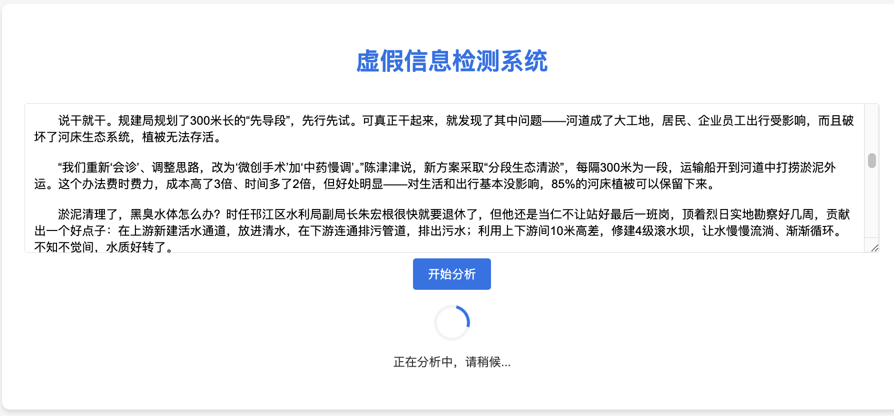
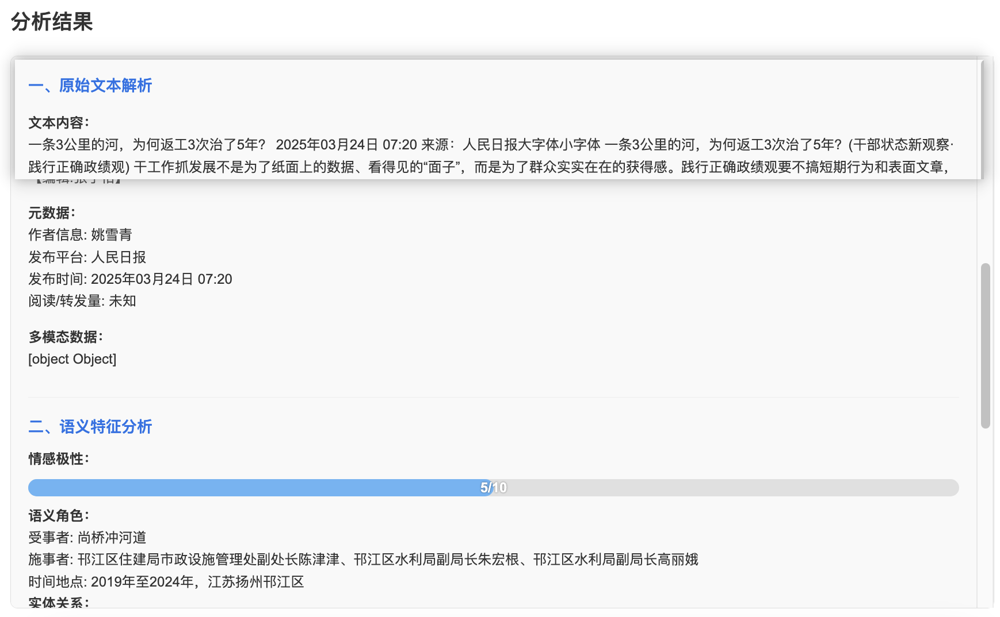
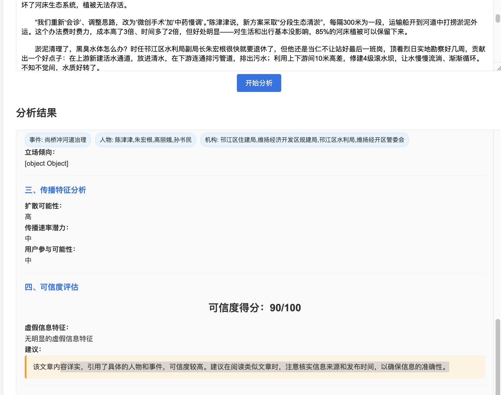

# 虚假信息检测系统 README.md

## 项目概述
虚假信息检测系统是一个基于Web的应用程序，旨在分析文本内容，检测其中是否存在虚假信息，并提供详细的分析报告。该系统通过调用强大的AI模型，对文本进行多维度的解析和评估，帮助用户快速判断信息的可信度。

## 功能特点

### 文本解析与分析
- **原始文本解析**：完整保留输入文章的段落结构、标点符号、特殊字符，并提取可能的发布时间、作者信息、发布平台、阅读/转发量等传播属性，同时识别文本中提到的图片、视频、超链接等非文本元素。
- **语义特征提取**：量化文本的情绪强度及正负面倾向（1-10分），识别施事者、受事者、时间地点等语义框架，构建人物、机构、事件间的关联，分析作者对核心议题的立场倾向性。
- **传播特征分析**：评估信息在社交网络传播的可能性、传播潜在速度以及转发、评论的可能性。

### 虚假信息评估
- **可信度评分**：给出0-100的可信度评分，分数越高表示文本越可信。
- **虚假信息特征**：列出文本中可能的虚假信息特征，帮助用户识别虚假信息的常见模式。
- **建议**：提供识别类似虚假信息的建议，提升用户的信息辨别能力。

## 技术架构

### 前端
- **HTML/CSS/JavaScript**：构建用户界面，实现文本输入、结果展示等功能。
- **响应式设计**：适配不同设备屏幕尺寸，提供良好的用户体验。

### 后端
- **Flask**：Python微框架，用于构建Web服务器，处理前端请求。
- **DeepSeek AI API**：调用DeepSeek的AI模型进行文本分析，获取虚假信息检测结果。

## 环境配置

### 前端
无需额外配置，直接在浏览器中打开index.html文件即可使用。

### 后端
1. **安装Python**：确保已安装Python 3.6或更高版本。
2. **安装Flask**：在终端中运行以下命令安装Flask：
    ```bash
    pip install flask
    ```
3. **配置API密钥**：创建一个名为config.json的文件，内容如下：
    ```json
    {
        "api_key": "your_deepseek_api_key",
        "ai_model": "deepseek-chat"
    }
    ```
   将`your_deepseek_api_key`替换为实际的DeepSeek API密钥。

4. **运行后端服务**：在终端中运行以下命令启动Flask应用：
    ```bash
    python app.py
    ```

## 使用方法

1. **启动后端服务**：按照上述后端配置步骤启动Flask应用，确保服务运行在`http://127.0.0.1:5000/`。
2. **打开前端页面**：在浏览器中打开index.html文件。
3. **输入文本**：在文本框中输入需要分析的文本内容。
4. **开始分析**：点击“开始分析”按钮，系统将自动将文本发送到后端进行分析。
5. **查看结果**：分析完成后，结果区域将显示详细的分析报告，包括原始文本解析、语义特征分析、传播特征分析以及虚假信息评估等内容。

## 注意事项

- **API限制**：DeepSeek API可能有请求频率限制，请合理控制请求次数。
- **文本长度**：过长的文本可能会影响分析速度和结果准确性，建议输入适量的文本内容。
- **网络连接**：确保后端服务与DeepSeek API服务器的网络连接正常，以避免分析失败。

## 效果图及示例



### 输入文本
据最新消息，某知名科技公司即将发布一款革命性的新产品，该产品将彻底改变行业格局。消息来源称，这款产品已经过多次内部测试，性能卓越，预计将在下周的发布会上正式亮相。

### 分析结果

#### 原始文本解析
- **文本内容**：完整保留上述输入文本。
- **元数据**：无明确元数据信息。
- **多模态数据**：无图片、视频、超链接等非文本元素。

#### 语义特征分析
- **情感极性**：6/10（略偏正面）
- **语义角色标注**：识别出施事者为“某知名科技公司”，受事者为“新产品”，时间地点为“下周发布会”。
- **实体关系图谱**：构建了科技公司与新产品之间的发布关系。
- **立场检测**：作者对新产品持积极立场。

#### 传播特征分析
- **扩散可能性**：较高，因涉及知名企业与革命性产品。
- **传播速率潜力**：较快，科技类消息易引发关注。
- **用户参与可能性**：较高，可能引发大量转发与讨论。

#### 虚假信息评估
- **可信度评分**：75/100
- **虚假信息特征**：无明显虚假信息特征，但缺乏具体证据支持。
- **建议**：建议进一步核实消息来源，查看官方公告或权威媒体报道。

## 联系与支持
如在使用过程中遇到问题或有任何建议，请联系开发者或访问项目支持页面获取帮助。
微信：tomorrow_me-
